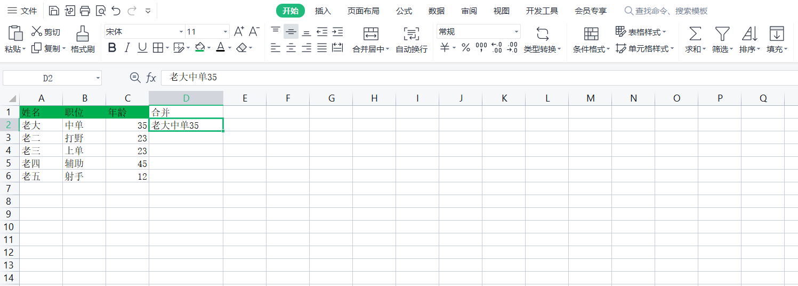
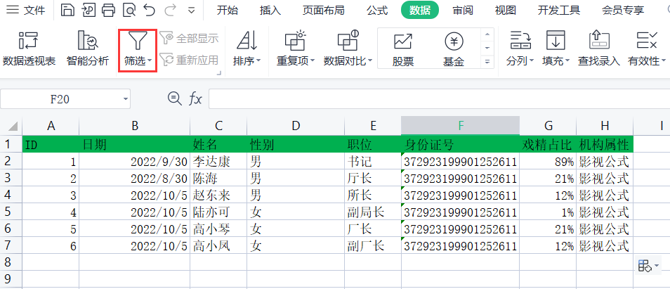

# excel

## 01-内容填充

- 快捷键 ctrl+e 
- 鼠标加号下拉选择智能填充
- 开始 填充 智能填充

## 02-数据录入

- 录入 
  - 横向录入 tab  回退 shift+tab
  - 纵向录入 enter 回退 shift+enter

- 日期录入

  - 格式 - 或者/ 

  - 年月日 ：ctrl+;      时分：ctrl+shift+;  年月日时分: =NOW()
  - 可筛选  点击头部数据进行筛选

- 百分比录入
  - 选中列 选择（常规） -  百分比 
  - 如需去掉两位小数可选择--下的减少小数位数

