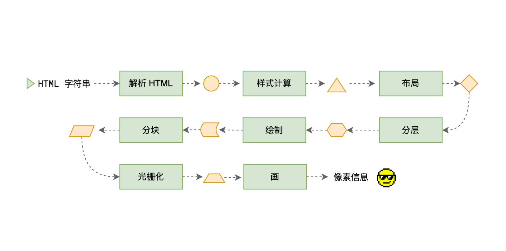

## 网页生成过程

- HTML被HTML解析器解析成DOM树
- css则被css解析器解析成CSSOM树
- 结合dom树和cssom树生成渲染树
- 生成布局，将布局绘制屏幕上

## css的盒模型

- 在HTML页面中所有的元素都可以看成一个盒子
- 盒子的组成：内容conttent、内边距padding、边框border、外边距margin
- 盒模型类型：
  - 标准盒模型 margin+border+padding+content
  - IE盒模型 margin+content(border+padding)
- 控制盒模型的模式：
  - box-sizing:content-box(默认值，标准盒模型)
  - box-sizing:border-box(IE盒模型)

## 重排（回流）

- 当DOM的变化影响到元素的几何信息，浏览器需要重新计算元素的几何属性，将其安放在正确位置，这个过程叫重排 （添加或者删除可见DOM元素，元素尺寸改变）

## 重绘

- 当一个元素外观发生改变，没有改变布局，这个过程叫重绘  （color,background）

## BFC

- BFC （块级格式化上下文），是一个独立的渲染区域，让处于 BFC 内部的元素与外部的元素相互隔离，使内外元素的定位不会相互影响。
- 如何创建BFC?
  - 方法①：float 的值不是none
  - 方法②：position的值不是 static 或者relative
  - 方法③：display的值是inline-block flex
  - 方法④：overflow:hidden

- BFC的其它作用
  - BFC可以取消盒子margin 塌陷
  - BFC可以阻止元素被浮动的元素覆盖

## px em rem vw vh

- px 绝对长度单位 1px = 1个像素 
- em 相对长度单位 相对于当前元素内的字体尺寸 
- rem 是css3新增的一个相对单位 基于html元素的字体大小来决定 
- vh vw 是相对于视口的长度单位 1vh等于视口宽度的1% 1vw等于视口宽度的1%

## 水平垂直居中

- 定宽高2种  

  ```css
  1. 父元素 position: relative; 子元素 position: absolute; left:50%;top:50%;margin-left:-100px;margin-top:-100px;
   
  2. 父元素 position: relative; 子元素 position: absolute; left:0;right:0;top:0;bottom:0;margin:auto;
  ```

- 不定宽高3种

  ```css
  3. 父元素 display: flex;justify-content: center;align-items: center;
  
  4. 父元素 position: relative; 子元素 position: absolute; left:50%;top:50%;transform: translate(-50%, -50%);
  
  5. 父元素 display: table-cell;vertical-align: middle;text-align: center; 子元素 display: inline-block;
  ```

### offset client scroll

- offsetHeight offsetWidth: border + padding + content
- clientHeight clientWidth: padding + content
- scrollHeight scrollWidth: padding + 实际内容尺寸

## 网页渲染流水线



- 解析HTML、样式计算、布局、分层、绘制、分块、光栅化、画、像素信息

## 浏览器是如何渲染页面的？

当浏览器的网络线程收到 HTML 文档后，会产生一个渲染任务，并将其传递给渲染主线程的消息队列。

在事件循环机制的作用下，渲染主线程取出消息队列中的渲染任务，开启渲染流程。

-------

整个渲染流程分为多个阶段，分别是： HTML 解析、样式计算、布局、分层、绘制、分块、光栅化、画

每个阶段都有明确的输入输出，上一个阶段的输出会成为下一个阶段的输入。

这样，整个渲染流程就形成了一套组织严密的生产流水线。

-------

渲染的第一步是**解析 HTML**。

解析过程中遇到 CSS 解析 CSS，遇到 JS 执行 JS。为了提高解析效率，浏览器在开始解析前，会启动一个预解析的线程，率先下载 HTML 中的外部 CSS 文件和 外部的 JS 文件。

如果主线程解析到`link`位置，此时外部的 CSS 文件还没有下载解析好，主线程不会等待，继续解析后续的 HTML。这是因为下载和解析 CSS 的工作是在预解析线程中进行的。这就是 CSS 不会阻塞 HTML 解析的根本原因。

如果主线程解析到`script`位置，会停止解析 HTML，转而等待 JS 文件下载好，并将全局代码解析执行完成后，才能继续解析 HTML。这是因为 JS 代码的执行过程可能会修改当前的 DOM 树，所以 DOM 树的生成必须暂停。这就是 JS 会阻塞 HTML 解析的根本原因。

第一步完成后，会得到 DOM 树和 CSSOM 树，浏览器的默认样式、内部样式、外部样式、行内样式均会包含在 CSSOM 树中。

-------

渲染的下一步是**样式计算**。

主线程会遍历得到的 DOM 树，依次为树中的每个节点计算出它最终的样式，称之为 Computed Style。

在这一过程中，很多预设值会变成绝对值，比如`red`会变成`rgb(255,0,0)`；相对单位会变成绝对单位，比如`em`会变成`px`

这一步完成后，会得到一棵带有样式的 DOM 树。

--------

接下来是**布局**，布局完成后会得到布局树。

布局阶段会依次遍历 DOM 树的每一个节点，计算每个节点的几何信息。例如节点的宽高、相对包含块的位置。

大部分时候，DOM 树和布局树并非一一对应。

比如`display:none`的节点没有几何信息，因此不会生成到布局树；又比如使用了伪元素选择器，虽然 DOM 树中不存在这些伪元素节点，但它们拥有几何信息，所以会生成到布局树中。还有匿名行盒、匿名块盒等等都会导致 DOM 树和布局树无法一一对应。

-----------

下一步是**分层**

主线程会使用一套复杂的策略对整个布局树中进行分层。

分层的好处在于，将来某一个层改变后，仅会对该层进行后续处理，从而提升效率。

滚动条、堆叠上下文、transform、opacity 等样式都会或多或少的影响分层结果，也可以通过`will-change`属性更大程度的影响分层结果。

---------

再下一步是**绘制**

主线程会为每个层单独产生绘制指令集，用于描述这一层的内容该如何画出来。

------

完成绘制后，主线程将每个图层的绘制信息提交给合成线程，剩余工作将由合成线程完成。

合成线程首先对每个图层进行分块，将其划分为更多的小区域。

它会从线程池中拿取多个线程来完成分块工作。

----

分块完成后，进入**光栅化**阶段。

合成线程会将块信息交给 GPU 进程，以极高的速度完成光栅化。

GPU 进程会开启多个线程来完成光栅化，并且优先处理靠近视口区域的块。

光栅化的结果，就是一块一块的位图

---------

最后一个阶段就是**画**了

合成线程拿到每个层、每个块的位图后，生成一个个「指引（quad）」信息。

指引会标识出每个位图应该画到屏幕的哪个位置，以及会考虑到旋转、缩放等变形。

变形发生在合成线程，与渲染主线程无关，这就是`transform`效率高的本质原因。

合成线程会把 quad 提交给 GPU 进程，由 GPU 进程产生系统调用，提交给 GPU 硬件，完成最终的屏幕成像。

## 为什么 transform 的效率高？

因为 transform 既不会影响布局也不会影响绘制指令，它影响的只是渲染流程的最后一个「draw」阶段

由于 draw 阶段在合成线程中，所以 transform 的变化几乎不会影响渲染主线程。反之，渲染主线程无论如何忙碌，也不会影响 transform 的变化。
