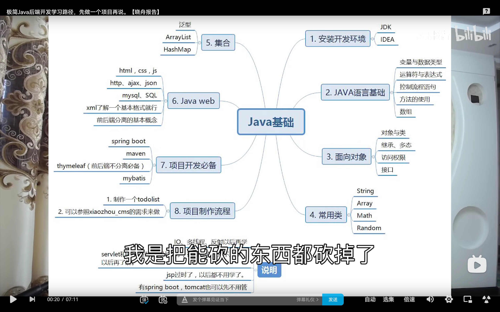
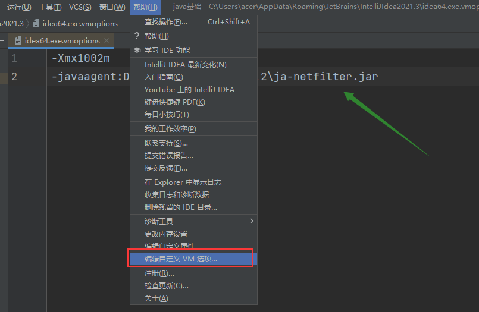
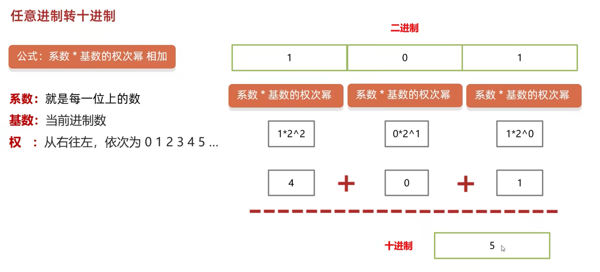
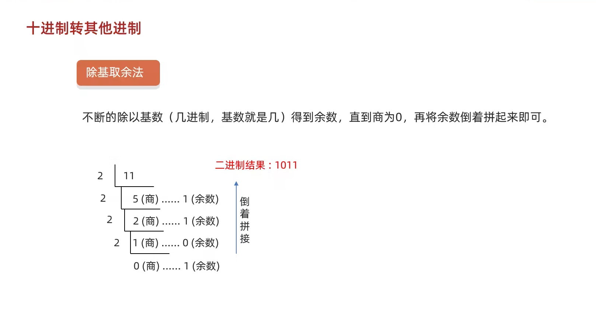

# 后端知识总结

## 学习路线



## java jdk 配置

- jdk 下载 https://www.oracle.com/java/technologies/downloads/
- jdk 安装目录 D:\Program
- jre 安装路径 D:\Program\Jre(新建空文件夹)
- 配置环境变量（用户变量）

```bash
新建 JAVA_HOME  目录D:\Program\Java\jdk1.8.0_321

Path编辑 新建 %JAVA_HOME%\bin
```

## idea 破解方法(2021.3)

- ja-netfilter-v2.2.2 文件解压到 D 盘根目录 （在我百度网盘中）

- 打开 idea 点击帮助中的倒数第四项，修改配置文件

  

- 在文件中追加 -javaagent:D:\ja-netfilter-v2.2.2\ja-netfilter.jar 关闭重启后，**点击注册即可看到破解成功的到期时间**

## 进制转换

- 任意进制转10进制



- 十进制转其它进制



## 数据类型

- 基础数据类型：4大类 8种
  - byte short int(默认) long 整型
  - float double(默认)
  - char 字符型
  - boolean 布尔型
- 引用数据类型：String
- 注：long：加L/l 就是long类型   float: 加上 F/f就是float类型

## 标准javabean类

- 生成 快捷键 alt+insert
- idea插件 PTG，安装成功后，鼠标右键生成javabean

## 方法重载

- 概念：重载就是在一个类中，有相同的函数名称，但形参不同的函数

- 规则：

  - 方法名称必须相同
  - 参数列表必须不同(个数不同或者类型不同，参数排列顺序不同等)
  - 方法的返回类型可以相同也可以不相同
  - 仅仅返回类型不同不足以成为方法的重载

- 理论：方法名称相同时，编译器会根据调用方法的参数个数,参数类型等去逐个匹配，以选择对应的方法，如果匹配失败，则编译器报错

  ```java
  public class demo1 {
      //主方法
      public static void main(String[] args) {
          double sum = add(1,3,23);
          System.out.println(sum);
      }
      //加法方法
      public static int add(int a,int b) {
          return a+b;
      }
      //方法重载
      public static double add(double a,double b,double c) {
          return a+b+c;
      }
  }
  ```


## java继承注意

- 1.java只能单继承，不能多继承，但可以多层继承
- java中所有的类都直接或者间接继承于Object类
- 子类只能访问父类中非私有的成员

## Static静态注意

- 静态方法只能访问静态变量和静态方法
- 非静态方法可以访问静态变量或者静态方法，也可以访问非静态的成员变量和非静态的成员方法
- 静态方法中是没有this关键字

## int和Integer的区别

1. 数据类型不同；int是基础数据类型，而Integer是包装数据类型

2. 默认值不同；int的默认值是0，而Integer的默认值是null

3. 内存中存储的方式不同：int 在内存中直接存储的是数据值，而 Integer 实际存储的是对象引用，当 new 一个 Integer 时实际上是生成一个指针指向此对象；
4. 实例化方式不同：Integer 必须实例化才可以使用，而 int 不需要
5. 变量的比较方式不同：int 可以使用 == 来对比两个变量是否相等，而 Integer 一定要使用 equals 来比较两个变量是否相等
