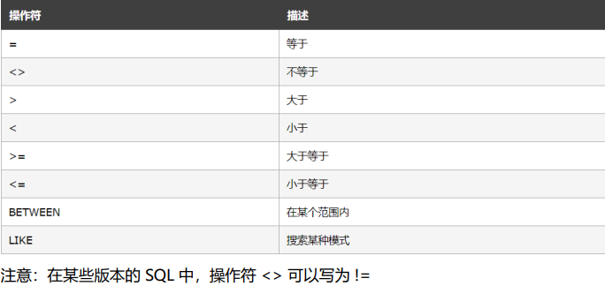

# mysql

## 01-启动mysql

- net start mysql
- 进入：mysql -u root -p

## 02-DDL-数据库操作 A123/

- 查询
  - 查询所有数据库`SHOW DATABASES;`
  - 查询当前数据库`SELECT DATABASE();`
- 创建
  - `CREATE DATABASE 数据库名`
  - `CREATE DATABASE [IF NOT EXISTS] 数据库名 [DEFAULT CHARSET 字符集] [COLLATE 排序规则];`
- 删除
  - `DROP DATABASE [IF EXISTS] 数据库名;`
- 使用
  - `USE 数据库名;`

## 03-DDL-表操作

- 查询

  - 当前数据库的所有表 `SHOW TABLES;`
  - 查询表结构 `DESC 表名;`
  - 查询指定表的建表语句`SHOW CREATE TABLE 表名;`

- 创建表

  ```sql
  CREATE TABLE 表名(
  	字段1 字段1类型 [COMMENT 字段1注释]， 
  	字段2 字段2类型 [COMMENT 字段2注释]
  )[COMMENT 表注释];
  alter table emp change nickname tickname varchar(10);
  ```
  
- 添加

  - 添加字段 `ALTER TABLE 表名 ADD 字段名 类型 [COMMENT 注释][约束];`

- 修改

  - 修改数据类型 `ALTER TABLE 表名 MODIFY 字段名 新数据类型 ;`
  - 修改字段名和字段类型 `ALTER TABLE 表名 CHANGE  旧字段名 新字段名 类型 [COMMENT 注释];`

- 删除

  - 删除字段 `ALTER TABLE 表名 DROP 字段名;`

- 修改表名

  - `ALTER TABLE 表名 RENAME TO 新表名;`

- 删除表

  - `DROP TABLE IF EXISTS 表名;`
  - 删除指定表 并重新创建该表`TRUNCATE TABLE 表名;`

## 04-DML-添加数据

- 添加数据
  - 给指定字段添加数据 `insert into 表名 (字段1，字段2...) values (值1，值2...)`
  - 给全部字段添加数据 `insert into 表名 values (值1，值2)`
  - 批量添加数据 
    - `insert into 表名 （字段1，字段2...） values (值1，值2...)，(值1，值2...)`
    - `insert into 表名 values (值1，值2...)，(值1，值2...)`
- 更新数据
  - 注意：修改语句的条件可以有，也可以没有，如果没有条件，则会修改整张表的所有数据
  - `UPDATE SET 表名 字段1=值1，字段2=值2...[WHERE 条件]`
- 删除数据
  - `DELETE FROM 表名 [WHERE 条件]`

## 05-DQL-查询语句

- 查询多个字段
  - SELECT 字段，字段2... FROM 表名；
  - SELECT * FROM 表名；
  - 设置别名 SELECT 字段1 [as 别名1],字段2 [别名2]... FROM 表名；
  - 不要重读的SELECT DISTINCT name FROM 表名 ；
-  聚合函数（null值不参与所有聚合函数运算）
  - count 统计梳理
  - max 最大值   min最小值  avg平均值  sum求和
  - SELECT 聚合函数(字段列表) from 表名；

## mysql 基本语法

- 1. SELECT 从表中查询数据

  ```sql
  -- 表示注释

  -- 从from指定的表中，查询所有数据 *表示所有列
  SELECT * FROM 表名称

  -- 从from指定的表中 查询指定列名称数据，查询多个可以逗号分隔
  SELECT 列名称 FROM 表名称
  ```

- 2. INSERT INTO 向表中插入新的数据行

  ```sql
  INSERT INTO 表名 (列1,列2...) VALUES (值1,值2...)
  ```

- 3. UPDATE 修改表中数据

  ```sql
  UPDATE 表名 SET 列名称 = '新值' WHERE id = ?
  ```

- 4. DELETE 删除表中行

  ```
  DELETE FROM 表名 WHERE id = ?
  ```

- 5. WHERE 限定选择的标准

  

- 6. AND 和 OR 运算符

  ```sql
  AND 表示必须同时满足多个条件
  OR  表示只要满足任意一个条件即可

  SELECT * FROM users WHERE status=0 AND id<3
  ```

- 7. ORDER BY 升序 降序

  ```SQL
  升序
  SELECT * FROM users ORDER BY id ASC

  降序
  SELECT * FROM users ORDER BY id DESC
  ```

- 8. COUNT(\*) 返回总数据条数

  ```
  SELECT COUNT(*) FROM usrs
  ```

## node 中使用 mysql

- 1. 安装 mysql 模块 `npm install mysql`

- 2. 配置 mysql 模块

  ```js
  const mysql = require('mysql')

  // 1. 建立与mysql 数据库连接
  const db = mysql.createPool({
    host: '127.0.0.1',
    user: 'root',
    password: '123456',
    database: 'student',
  })

  // 测试是否连接成功
  db.query('SELECT 1', (err, result) => {
    if (err) return console.log(err.message)
    console.log(result) //[ RowDataPacket { '1': 1 } ]
  })
  ```

- 3. 查询数据

  ```js
  const selectSql = 'SELECT * FROM users'
  db.query(selectSql, (err, result) => {
    if (err) return console.log(err.message)
    console.log(result)
  })
  ```

- 4. 插入数据

  ```js
  // 1.需要插入的数据
  const user = {
    username: 'jack',
    password: '123456',
  }
  // 2.执行sql ?占位符
  const sqlStr = 'INSERT INTO users SET ?'

  db.query(sqlStr, user, (err, result) => {
    if (err) return console.log(err.message)
    if (result.affectedRows === 1) {
      console.log('插入数据成功')
    }
  })
  ```

- 5. 更新数据

  ```js
  const user = { id: 2, username: 'admin', password: 'admin123' }

  const sqlStr = 'UPDATE users SET ? WHERE id=?'

  db.query(sqlStr, [user, user.id], (err, result) => {
    if (err) return console.log(err.message)

    if (result.affectedRows === 1) {
      console.log('更新数据成功')
    }
  })
  ```

- 6. 删除数据

  ```js
  const sqlStr = 'DELETE FROM users WHERE id=?'

  db.query(sqlStr, 2, (err, result) => {
    if (err) return console.log(err.message)
    if (result.affectedRows === 1) {
      console.log('删除数据成功')
    }
  })
  ```

- 7. 标记删除

  ```js
  const sqlStr = 'UPDATE users SET isDelete=1 WHERE id=?'

  db.query(sqlStr, 1, (err, result) => {
    if (err) return console.log(err.message)
    if (result.affectedRows === 1) {
      console.log('删除数据成功')
    }
  })
  ```

- 8. 查询 isDelete=1 的数据

  ```js
  const sqlStr = 'SELECT * FROM users WHERE isDelete=?'
  
  db.query(sqlStr, 1, (err, result) => {
    if (err) return console.log(err.message)
    console.log(result)
  })
  ```
