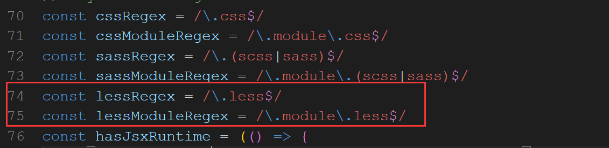

# CMS后台系统

## 一、 项目起步

- 1. 创建项目

  ```
  npx create-react-app cms-manage
  ```

- 2. 安装依赖

  ```
  npm i antd redux react-redux react-router-dom@6 axios less less-loader@6.0.0 --save
  ```

## 二、配置less

- 1. 暴漏出webpack.config配置文件 `npm run eject`

- 2. 修改webpack.config.js文件

  

  ```js
  const lessRegex = /\.less$/
  const lessModuleRegex = /\.module\.less$/
  ```

   全局搜索oneOf，在oneOf数组中添加以下代码

  ```js
  {
    test: lessRegex,
      exclude: lessModuleRegex,
        use: getStyleLoaders(
          {
            importLoaders: 2,
            sourceMap: isEnvProduction
              ? shouldUseSourceMap
              : isEnvDevelopment,
          },
          "less-loader"
        ),
          sideEffects: true,
  },
  {
    test: lessModuleRegex,
      use: getStyleLoaders(
        {
          importLoaders: 2,
          sourceMap: isEnvProduction
            ? shouldUseSourceMap
            : isEnvDevelopment,
          modules: {
            getLocalIdent: getCSSModuleLocalIdent,
          },
        },
        "less-loader"
      ),
  },
  ```

- 3. src下创建 assets>base.less

  ```less
  @import '~antd/dist/antd.css';
  @bgcolor: #efefef;
  body {
    font-family: '微软雅黑';
    font-size: 14px;
    color: #333;
    background: @bgcolor;
  }
  ```

- 4. index.js中引入 import './assets/base.less'

## 三、 配置路由

- 1. src 下创建 router>index.js

  ```js
  import App from '../App'
  import List from '../pages/List'
  import Edit from '../pages/Edit'
  import Means from '../pages/Means'
  import Login from '../pages/Login'
  import Register from '../pages/Register'
  
  import { BrowserRouter as Router, Routes, Route } from 'react-router-dom'
  
  const BaseRouter = () => (
    <Router>
      <Routes>
        <Route path="/" element={<App />}>
          <Route path="/list" element={<List />}></Route>
          <Route path="/edit" element={<Edit />}></Route>
          <Route path="/means" element={<Means />}></Route>
        </Route>
        <Route path="/login" element={<Login />}></Route>
        <Route path="/register" element={<Register />}></Route>
      </Routes>
    </Router>
  )
  
  export default BaseRouter
  ```

- 2. 入口文件  index.js 引入、

  ```js
  import Router from './router'
  
  <App /> 替换 <Router />
  ```

- 3. app.js 增加位置

  ```js
  import { Outlet } from 'react-router-dom'
  
  <Outlet />
  ```

  