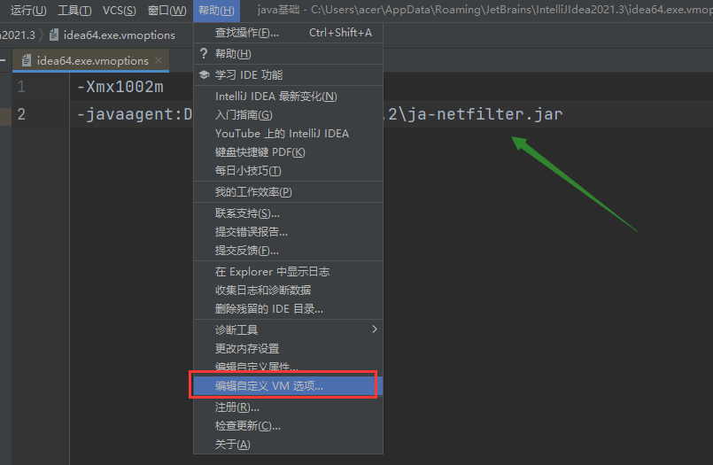

# 后端知识总结

## java jdk 配置

- jdk 下载 https://www.oracle.com/java/technologies/downloads/
- jdk 安装目录 D:\Program
- jre 安装路径 D:\Program\Jre(新建空文件夹)
- 配置环境变量（用户变量）

```bash
新建 JAVA_HOME  目录D:\Program\Java\jdk1.8.0_321

Path编辑 新建 %JAVA_HOME%\bin
```

## idea 破解方法(2021.3)

- ja-netfilter-v2.2.2 文件解压到 D 盘根目录 （在我百度网盘中）

- 打开 idea 点击帮助中的倒数第四项，修改配置文件

  

- 在文件中追加 -javaagent:D:\ja-netfilter-v2.2.2\ja-netfilter.jar 关闭重启后，**点击注册即可看到破解成功的到期时间**

## 方法重载

- 概念：重载就是在一个类中，有相同的函数名称，但形参不同的函数

- 规则：

  - 方法名称必须相同
  - 参数列表必须不同(个数不同或者类型不同，参数排列顺序不同等)
  - 方法的返回类型可以相同也可以不相同
  - 仅仅返回类型不同不足以成为方法的重载

- 理论：方法名称相同时，编译器会根据调用方法的参数个数,参数类型等去逐个匹配，以选择对应的方法，如果匹配失败，则编译器报错

  ```java
  public class demo1 {
      //主方法
      public static void main(String[] args) {
          double sum = add(1,3,23);
          System.out.println(sum);
      }
      //加法方法
      public static int add(int a,int b) {
          return a+b;
      }
      //方法重载
      public static double add(double a,double b,double c) {
          return a+b+c;
      }
  }
  ```

  
